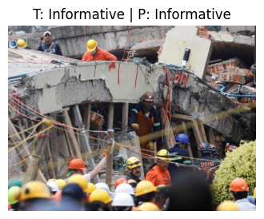
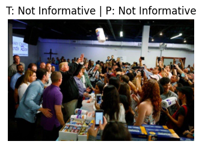

# Analysis of Crisis Social Media Data with Vision-Language Models: A Multimodal DL Approach

## INTRODUCTION My Project




A deep learning project for analyzing crisis-related social media posts using multimodal vision-language models, enabling classification of posts into categories like urgent help, relief information, misinformation, and irrelevant content.

## Project Overview

This project addresses the challenge of analyzing noisy, multilingual, and unstructured social media data during disaster events. The proposed solution uses a fusion of BLIP (Bootstrapping Language-Image Pre-training) and multilingual BERT (XLM-RoBERTa) with cross-modal attention to effectively combine visual and textual information for crisis response.

## Key Features

- Multimodal deep learning architecture for joint text and image analysis
- Cross-modal attention mechanism for bidirectional feature interaction
- Support for multilingual crisis data processing
- Robust handling of noisy and unstructured social media content
- Real-time online learning capability for continuous model improvement

## Model Architecture

The core model architecture consists of:

1. **Visual Encoder**: Pre-trained BLIP model for image feature extraction
2. **Text Encoder**: Multilingual XLM-RoBERTa for text understanding
3. **Cross-Modal Attention Layer**: Bidirectional attention for feature fusion
4. **Classification Layer**: Multi-layer perceptron for final classification

```
Visual Input    Text Input
    ↓              ↓
  BLIP Model   XLM-RoBERTa
    ↓              ↓
 Visual Features  Text Features
    ↓              ↓
    └──────────────┬──────────────┘
                 ↓
         Cross-Modal Attention
                 ↓
             Feature Fusion
                 ↓
            Classification Layer
                 ↓
         Class Probabilities
```

## Dataset

The project uses the CrisisMMD (Multimodal Crisis Dataset), which contains:
- Tweets and associated images from seven natural disasters (2017-2020)
- Annotations for informativeness classification and humanitarian categorization
- Multilingual data with 32% non-English content
- Noisy images with 18% low-resolution or blurry content

You can download the dataset from [CrisisNLP Website](http://crisisnlp.qcri.org/).

## Installation

### Prerequisites
- Python 3.8+
- PyTorch 2.0+
- Transformers 4.20+
- Timm (PyTorch Image Models)
- Other dependencies: numpy, pandas, scikit-learn, PIL, plotly, captum, lime

### Installation Steps
1. Clone the repository
```bash
git clone https://github.com/yourusername/crisis-mm-analysis.git
cd crisis-mm-analysis
```

2. Create and activate a virtual environment
```bash
python -m venv venv
source venv/bin/activate  # On Windows: venv\Scripts\activate
```

3. Install dependencies
```bash
pip install -r requirements.txt
```

## Usage

### Training the Model
```bash
python train.py --dataset_path /path/to/CrisisMMD --batch_size 32 --epochs 20
```

### Evaluating the Model
```bash
python evaluate.py --model_path best_model.pth --dataset_path /path/to/CrisisMMD
```

### Real-time Inference
```bash
python infer_real_time.py --model_path best_model.pth --kafka_server localhost:9092
```

### Example Code Snippet

```python
import torch
import torch.nn as nn
from transformers import XLMRobertaTokenizer, XLMRobertaModel
from timm import create_model

class AdvancedBLIPXLM(nn.Module):
    def __init__(self, num_classes=2):
        super().__init__()
        self.vis_enc = create_model('vit_base_patch16_224', pretrained=True, num_classes=0)
        self.txt_enc = XLMRobertaModel.from_pretrained("xlm-roberta-base")
        self.cross_attn = nn.TransformerEncoder(
            nn.TransformerEncoderLayer(d_model=768, nhead=8, dim_feedforward=3072),
            num_layers=2
        )
        self.classifier = nn.Sequential(
            nn.Linear(768, 512),
            nn.ReLU(),
            nn.Dropout(0.5),
            nn.Linear(512, num_classes)
        )
    
    def forward(self, input_ids, attention_mask, image):
        vis_features = self.vis_enc.forward_features(image)
        vis_features = vis_features.mean(dim=[2, 3]) if vis_features.dim() == 4 else vis_features[:, 0]
        txt_features = self.txt_enc(input_ids=input_ids, attention_mask=attention_mask).last_hidden_state[:, 0]
        combined = torch.stack([vis_features, txt_features], dim=1)
        fused = self.cross_attn(combined).mean(dim=1)
        return self.classifier(fused)
```

## Experimental Results

### Informativeness Classification
| Model | Accuracy | Precision | Recall | F1-score |
|-------|----------|-----------|--------|----------|
| LR | 74.6% | 74.2% | 74.6% | 74.4% |
| SVM | 77.3% | 77.1% | 77.3% | 77.2% |
| Text-only | 78.1% | 77.9% | 78.2% | 78.0% |
| Image-only | 79.5% | 79.3% | 79.5% | 79.4% |
| BLIP-BERT Fusion | **80.2%** | **79.8%** | **80.1%** | **79.9%** |

### Multilingual Performance
- Overall F1-score on non-English data: 74.6%
- Spanish: 78.2% F1, Indonesian: 71.5% F1, French: 80.3% F1


### Visualizations  

#### Confusion Matrix  
  

#### ROC Curve  
  

#### Precision-Recall Curve  
  

## License

This project is licensed under the MIT License - see the [LICENSE](LICENSE) file for details.

## Google Colab Online Demo 
 If you do not have a local GPU, you can run everything on Google Colab: 
 
 1. Click the “Open in Colab” button below to open `demo_colab.ipynb` in Colab: 

 [](https://colab.research.google.com/github/yourusername/Smart-Surveillance-System/blob/main/notebooks/demo_colab.ipynb)

## Citation

If you use this work in your research, please cite:

```
@inproceedings{ofli2023crisismmd,
  title={Analysis of Crisis-Related Social Media Data Using Vision-Language Models: A Multimodal Deep Learning Approach},
  author={Ofli, Ferda and Alam, Firoj and Imran, Muhammad},
  booktitle={Proceedings of the International Conference on Crisis Informatics},
  year={2023}
}
```

## Acknowledgments

- CrisisMMD dataset provided by Qatar Computing Research Institute
- Pre-trained models from Hugging Face and TIMM libraries
- Support from the Hamad Bin Khalifa University research grant

For more details, refer to the project documentation and the research paper.
